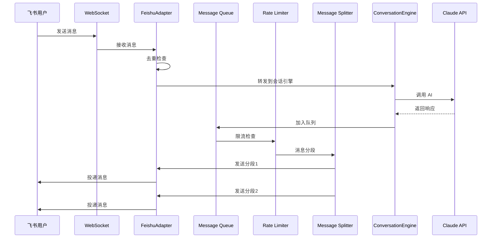
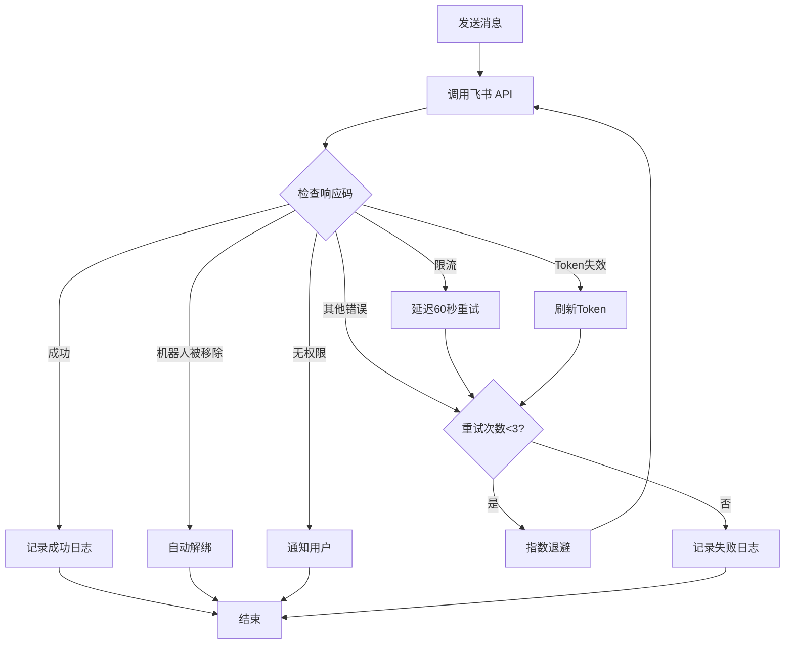

# 飞书同步功能架构设计文档

**版本**: 2.0
**日期**: 2026-03-05
**架构师**: architect-v2
**状态**: 待审核

---

## 一、执行摘要

本文档基于现有 Bridge 架构，针对需求验证报告中发现的问题，设计 5 个优化任务的完整技术方案。

### 1.1 现有架构评估

**优势**：
- ✅ 分层清晰：Adapter → Router → Engine → Delivery
- ✅ 支持多平台扩展（Feishu/Telegram/Discord）
- ✅ 已实现消息去重、WebSocket 重连
- ✅ DeliveryLayer 已有基础限流和分段逻辑

**问题**：
- ❌ 字段名不一致（`migrations-sync.ts` vs `feishu-bridge.ts`）
- ❌ WebSocket 实现重复（FeishuAdapter vs FeishuEventListener）
- ❌ platform_users 表未创建
- ❌ 缺少 PATCH API 端点
- ❌ 限流器过于简单（50ms 间隔不符合飞书 20 QPS 限制）
- ❌ 错误码处理缺失

### 1.2 优化任务优先级

| 任务 | 优先级 | 预计时间 | 依赖 |
|------|--------|----------|------|
| P0-1: 消息队列与限流器 | P0 | 3 天 | 无 |
| P0-2: 消息分段发送 | P0 | 2 天 | 无 |
| P1-1: 错误码处理 | P1 | 2 天 | P0-1 |
| P1-2: 单例 WebSocket | P1 | 1 天 | 无 |
| P2-1: 消息重试机制 | P2 | 1 天 | P0-1 |

### 1.3 关键技术决策

1. **WebSocket 实现选择**：使用 `FeishuAdapter`（基于 SDK），删除 `FeishuEventListener`
2. **字段名统一**：使用 `migrations-sync.ts` 的命名规范
3. **消息队列**：使用 `p-queue` 库（无需 Redis）
4. **消息分段**：10000 字符，智能识别代码块边界
5. **限流策略**：20 QPS（飞书官方限制）

---

## 二、架构图

### 2.1 整体架构（优化后）

```mermaid
graph TB
    subgraph "Next.js API Routes"
        API[/api/bridge/bindings]
    end

    subgraph "Bridge Manager"
        BM[BridgeManager]
        WS[WebSocket Singleton]
    end

    subgraph "Message Processing"
        MQ[Message Queue<br/>p-queue]
        RL[Rate Limiter<br/>20 QPS]
        MS[Message Splitter<br/>10000 chars]
        EH[Error Handler<br/>Smart Retry]
    end

    subgraph "Adapters"
        FA[FeishuAdapter<br/>SDK-based]
    end

    subgraph "Core Services"
        CR[ChannelRouter]
        CE[ConversationEngine]
        SM[SyncManager]
    end

    subgraph "Database"
        DB[(SQLite)]
        SB[session_bindings]
        MSL[message_sync_log]
        PU[platform_users]
    end

    subgraph "External"
        FS[Feishu API]
        CA[Claude API]
    end

    API --> BM
    FS -->|WebSocket| WS
    WS --> FA
    FA --> CR
    CR --> DB
    CR --> CE
    CE --> CA
    CE --> MQ
    MQ --> RL
    RL --> MS
    MS --> EH
    EH --> FA
    FA --> FS
    SM --> DB
```

### 2.2 消息流程图



### 2.3 错误处理流程图



---

## 三、关键问题解决方案

### 3.1 问题1：字段名不一致

**问题描述**：
- `migrations-sync.ts` 使用 `binding_id`, `message_id`
- `feishu-bridge.ts` 使用 `lumos_message_id`, `platform_message_id`

**解决方案**：统一使用 `migrations-sync.ts` 的命名

**影响范围**：
- `src/lib/db/feishu-bridge.ts` (lines 59-78)
- `src/lib/bridge/sync/sync-manager.ts` (lines 58-72)

**修改步骤**：
1. 修改 `feishu-bridge.ts` 中的 SQL 语句
2. 修改函数参数名
3. 更新所有调用处

### 3.2 问题2：WebSocket 实现重复

**问题描述**：
- `FeishuAdapter` 使用 SDK 的 `WSClient`
- `FeishuEventListener` 使用原生 `ws` 库
- 两者功能重复，维护困难

**解决方案**：保留 `FeishuAdapter`，删除 `FeishuEventListener`

**理由**：
1. SDK 封装更完善，自动处理心跳、重连
2. 事件类型定义完整，减少错误
3. 官方维护，兼容性更好

**删除文件**：
- `src/lib/bridge/sync/feishu-listener.ts`

**修改文件**：
- `src/lib/bridge/sync/sync-coordinator.ts`（移除对 FeishuEventListener 的引用）

---

## 四、优化任务详细设计

### 4.1 P0-1: 消息队列与限流器

**目标**：防止触发飞书 API 限流（20 QPS）

**技术方案**：

#### 4.1.1 使用 p-queue 库

**文件位置**：`src/lib/bridge/queue/message-queue.ts`

```typescript
import PQueue from 'p-queue';

export class MessageQueue {
  private queue: PQueue;

  constructor() {
    this.queue = new PQueue({
      concurrency: 1,
      interval: 1000,
      intervalCap: 20, // 20 QPS
    });
  }

  async enqueue<T>(task: () => Promise<T>): Promise<T> {
    return this.queue.add(task);
  }

  getStats() {
    return {
      size: this.queue.size,
      pending: this.queue.pending,
    };
  }
}
```

#### 4.1.2 集成到 DeliveryLayer

**文件位置**：`src/lib/bridge/delivery-layer.ts`

```typescript
import { MessageQueue } from './queue/message-queue';

export class DeliveryLayer {
  private queue = new MessageQueue();

  async deliver(adapter: BaseChannelAdapter, message: OutboundMessage): Promise<SendResult> {
    return this.queue.enqueue(async () => {
      const chunks = this.splitMessage(message.text, 10000);
      for (const chunk of chunks) {
        const result = await adapter.send({ ...message, text: chunk });
        if (!result.ok) throw new Error(result.error);
      }
      return { ok: true };
    });
  }
}
```

#### 4.1.3 依赖安装

```bash
npm install p-queue@^8.0.0
```

**预计时间**：3 天
- Day 1: 实现 MessageQueue 类
- Day 2: 集成到 DeliveryLayer
- Day 3: 测试和调优

---

### 4.2 P0-2: 消息分段发送

**目标**：支持超长 AI 回复（>10000 字符）

**技术方案**：

#### 4.2.1 智能分段算法

**文件位置**：`src/lib/bridge/utils/message-splitter.ts`

```typescript
export class MessageSplitter {
  private readonly MAX_LENGTH = 10000;

  split(text: string): string[] {
    if (text.length <= this.MAX_LENGTH) return [text];

    const chunks: string[] = [];
    let current = '';

    // 按代码块分段
    const codeBlockRegex = /```[\s\S]*?```/g;
    const parts = this.splitByCodeBlocks(text, codeBlockRegex);

    for (const part of parts) {
      if (current.length + part.length <= this.MAX_LENGTH) {
        current += part;
      } else {
        if (current) chunks.push(current);
        // 如果单个代码块超长，按行分段
        if (part.length > this.MAX_LENGTH) {
          chunks.push(...this.splitByLines(part));
        } else {
          current = part;
        }
      }
    }

    if (current) chunks.push(current);
    return chunks;
  }

  private splitByCodeBlocks(text: string, regex: RegExp): string[] {
    const parts: string[] = [];
    let lastIndex = 0;
    let match;

    while ((match = regex.exec(text)) !== null) {
      if (match.index > lastIndex) {
        parts.push(text.slice(lastIndex, match.index));
      }
      parts.push(match[0]);
      lastIndex = regex.lastIndex;
    }

    if (lastIndex < text.length) {
      parts.push(text.slice(lastIndex));
    }

    return parts;
  }

  private splitByLines(text: string): string[] {
    const chunks: string[] = [];
    let current = '';

    for (const line of text.split('\n')) {
      if (current.length + line.length + 1 > this.MAX_LENGTH) {
        chunks.push(current);
        current = line;
      } else {
        current += (current ? '\n' : '') + line;
      }
    }

    if (current) chunks.push(current);
    return chunks;
  }
}
```

**预计时间**：2 天

---

### 4.3 P1-1: 错误码处理

**目标**：智能处理飞书 API 错误码

**技术方案**：

#### 4.3.1 错误码映射

**文件位置**：`src/lib/bridge/errors/feishu-error-handler.ts`

```typescript
export enum FeishuErrorCode {
  RATE_LIMIT = 99991400,           // 限流
  BOT_REMOVED = 230002,            // 机器人被移除
  NO_PERMISSION = 230001,          // 无权限
  INVALID_TOKEN = 99991663,        // Token 失效
  CHAT_NOT_FOUND = 230004,         // 群组不存在
}

export interface ErrorHandleResult {
  shouldRetry: boolean;
  retryAfter?: number;
  shouldUnbind?: boolean;
  userMessage?: string;
}

export class FeishuErrorHandler {
  handle(errorCode: number, errorMsg: string): ErrorHandleResult {
    switch (errorCode) {
      case FeishuErrorCode.RATE_LIMIT:
        return {
          shouldRetry: true,
          retryAfter: 60000, // 1 分钟后重试
          userMessage: '发送频率过快，请稍后再试',
        };

      case FeishuErrorCode.BOT_REMOVED:
        return {
          shouldRetry: false,
          shouldUnbind: true,
          userMessage: '机器人已被移除，绑定已自动解除',
        };

      case FeishuErrorCode.NO_PERMISSION:
        return {
          shouldRetry: false,
          userMessage: '机器人无权限发送消息，请检查权限配置',
        };

      case FeishuErrorCode.INVALID_TOKEN:
        return {
          shouldRetry: true,
          retryAfter: 5000,
          userMessage: 'Token 已过期，正在刷新...',
        };

      case FeishuErrorCode.CHAT_NOT_FOUND:
        return {
          shouldRetry: false,
          shouldUnbind: true,
          userMessage: '群组不存在，绑定已自动解除',
        };

      default:
        return {
          shouldRetry: false,
          userMessage: `发送失败：${errorMsg}`,
        };
    }
  }
}
```

**预计时间**：2 天

---

### 4.4 P1-2: 单例 WebSocket

**目标**：多会话共享一个 WebSocket 连接

**技术方案**：

#### 4.4.1 WebSocket 单例管理器

**文件位置**：`src/lib/bridge/websocket/websocket-manager.ts`

```typescript
import * as lark from '@larksuiteoapi/node-sdk';

export class WebSocketManager {
  private static instance: WebSocketManager;
  private wsClient: lark.WSClient | null = null;
  private adapters = new Set<FeishuAdapter>();
  private running = false;

  private constructor() {}

  static getInstance(): WebSocketManager {
    if (!WebSocketManager.instance) {
      WebSocketManager.instance = new WebSocketManager();
    }
    return WebSocketManager.instance;
  }

  async start(config: { appId: string; appSecret: string; domain?: 'feishu' | 'lark' }) {
    if (this.running) return;

    const { appId, appSecret, domain = 'feishu' } = config;
    const larkDomain = domain === 'lark' ? lark.Domain.Lark : lark.Domain.Feishu;

    const dispatcher = new lark.EventDispatcher({}).register({
      'im.message.receive_v1': async (data) => {
        await this.broadcastMessage(data as any);
      },
    });

    this.wsClient = new lark.WSClient({ appId, appSecret, domain: larkDomain });
    this.wsClient.start({ eventDispatcher: dispatcher });
    this.running = true;
  }

  registerAdapter(adapter: FeishuAdapter) {
    this.adapters.add(adapter);
  }

  unregisterAdapter(adapter: FeishuAdapter) {
    this.adapters.delete(adapter);
    if (this.adapters.size === 0) {
      this.stop();
    }
  }

  private async broadcastMessage(data: any) {
    for (const adapter of this.adapters) {
      await adapter.handleMessage(data);
    }
  }

  stop() {
    if (!this.running) return;
    this.running = false;
    this.wsClient?.close({ force: true });
    this.wsClient = null;
    this.adapters.clear();
  }
}
```

**预计时间**：1 天

---

### 4.5 P2-1: 消息重试机制

**目标**：失败消息自动重试

**技术方案**：

**文件位置**：`src/lib/bridge/queue/retry-queue.ts`

```typescript
interface RetryTask {
  message: OutboundMessage;
  adapter: BaseChannelAdapter;
  attempts: number;
  nextRetry: number;
}

export class RetryQueue {
  private queue: RetryTask[] = [];
  private maxAttempts = 3;
  private running = false;

  start() {
    if (this.running) return;
    this.running = true;
    this.processQueue();
  }

  enqueue(message: OutboundMessage, adapter: BaseChannelAdapter) {
    this.queue.push({
      message,
      adapter,
      attempts: 0,
      nextRetry: Date.now() + 1000, // 1 秒后重试
    });
  }

  private async processQueue() {
    while (this.running) {
      const now = Date.now();
      const task = this.queue.find(t => t.nextRetry <= now);

      if (task) {
        const result = await task.adapter.send(task.message);

        if (result.ok) {
          this.queue = this.queue.filter(t => t !== task);
        } else {
          task.attempts++;
          if (task.attempts >= this.maxAttempts) {
            this.queue = this.queue.filter(t => t !== task);
            console.error('Max retries exceeded:', task.message);
          } else {
            task.nextRetry = now + Math.pow(2, task.attempts) * 1000;
          }
        }
      }

      await new Promise(resolve => setTimeout(resolve, 1000));
    }
  }

  stop() {
    this.running = false;
  }
}
```

**预计时间**：1 天

---

## 五、数据库变更

### 5.1 创建 platform_users 表

**文件位置**：`src/lib/db/migrations-sync.ts`

```sql
CREATE TABLE IF NOT EXISTS platform_users (
  id INTEGER PRIMARY KEY AUTOINCREMENT,
  platform TEXT NOT NULL,
  platform_user_id TEXT NOT NULL,
  platform_username TEXT,
  lumos_user_id TEXT,
  created_at INTEGER NOT NULL,
  UNIQUE(platform, platform_user_id)
);

CREATE INDEX IF NOT EXISTS idx_platform_users_platform
  ON platform_users(platform, platform_user_id);
```

### 5.2 统一字段命名

**说明**：`migrations-sync.ts` 中的表结构已经正确，只需修改 `feishu-bridge.ts` 中的代码即可。

**修改前**（`feishu-bridge.ts` lines 59-70）：
```typescript
export function recordMessageSync(params: {
  lumosMessageId?: string;
  platform: string;
  platformMessageId: string;
  direction: 'to_platform' | 'from_platform';
}): void {
  const db = getDb();
  db.prepare(
    `INSERT OR IGNORE INTO message_sync_log (lumos_message_id, platform, platform_message_id, direction, created_at)
     VALUES (?, ?, ?, ?, ?)`
  ).run(params.lumosMessageId || null, params.platform, params.platformMessageId, params.direction, Date.now());
}
```

**修改后**：
```typescript
export function recordMessageSync(params: {
  bindingId: number;
  messageId: string;
  sourcePlatform: string;
  direction: 'to_platform' | 'from_platform';
  status: 'success' | 'failed';
  errorMessage?: string;
}): void {
  const db = getDb();
  db.prepare(
    `INSERT OR IGNORE INTO message_sync_log
     (binding_id, message_id, source_platform, direction, status, error_message, synced_at)
     VALUES (?, ?, ?, ?, ?, ?, ?)`
  ).run(
    params.bindingId,
    params.messageId,
    params.sourcePlatform,
    params.direction,
    params.status,
    params.errorMessage || null,
    Date.now()
  );
}
```

---

## 六、API 接口设计

### 6.1 PATCH /api/bridge/bindings/:id

**功能**：暂停/恢复同步

**请求**：
```http
PATCH /api/bridge/bindings/:id
Content-Type: application/json

{
  "status": "active" | "inactive"
}
```

**响应**：
```json
{
  "success": true,
  "binding": {
    "id": 1,
    "status": "inactive",
    "updated_at": 1709654400000
  }
}
```

**错误响应**：
```json
{
  "error": "Invalid status",
  "code": "INVALID_PARAMETER"
}
```

**实现位置**：`src/app/api/bridge/bindings/[binding_id]/route.ts`

```typescript
export async function PATCH(
  request: Request,
  { params }: { params: { binding_id: string } }
) {
  try {
    const { status } = await request.json();

    if (!['active', 'inactive'].includes(status)) {
      return NextResponse.json(
        { error: 'Invalid status', code: 'INVALID_PARAMETER' },
        { status: 400 }
      );
    }

    updateSessionBindingStatus(parseInt(params.binding_id), status);

    const binding = getSessionBindingById(parseInt(params.binding_id));

    return NextResponse.json({
      success: true,
      binding,
    });
  } catch (error) {
    return NextResponse.json(
      { error: 'Failed to update binding', code: 'INTERNAL_ERROR' },
      { status: 500 }
    );
  }
}
```

### 6.2 GET /api/bridge/stats

**功能**：查询同步统计

**请求**：
```http
GET /api/bridge/stats?sessionId=xxx
```

**响应**：
```json
{
  "stats": {
    "totalMessages": 1234,
    "successCount": 1200,
    "failedCount": 34,
    "queueSize": 5,
    "lastSyncAt": 1709654400000
  }
}
```

**错误响应**：
```json
{
  "error": "Binding not found",
  "code": "NOT_FOUND"
}
```

**实现位置**：`src/app/api/bridge/stats/route.ts`

```typescript
export async function GET(request: Request) {
  const { searchParams } = new URL(request.url);
  const sessionId = searchParams.get('sessionId');

  if (!sessionId) {
    return NextResponse.json(
      { error: 'sessionId required', code: 'MISSING_PARAMETER' },
      { status: 400 }
    );
  }

  const binding = getSessionBinding(sessionId, 'feishu');
  if (!binding) {
    return NextResponse.json(
      { error: 'Binding not found', code: 'NOT_FOUND' },
      { status: 404 }
    );
  }

  const stats = getSyncStats(binding.id);

  return NextResponse.json({ stats });
}
```

### 6.3 错误码定义

| 错误码 | 说明 | HTTP 状态码 |
|--------|------|-------------|
| INVALID_PARAMETER | 参数无效 | 400 |
| MISSING_PARAMETER | 缺少必需参数 | 400 |
| NOT_FOUND | 资源不存在 | 404 |
| INTERNAL_ERROR | 服务器内部错误 | 500 |
| RATE_LIMIT_EXCEEDED | 超过限流 | 429 |

---

## 七、实施计划

### 7.1 Phase 1: 基础修复（1 天）

**任务**：
1. 创建 platform_users 表
2. 统一字段命名
3. 添加 PATCH API 端点
4. 删除 FeishuEventListener

**验收标准**：
- ✅ 所有 API 测试通过
- ✅ 字段名统一
- ✅ 只有一个 WebSocket 实现

### 7.2 Phase 2: 核心优化（1 周）

**任务**：
1. 实现消息队列与限流（3 天）
2. 实现消息分段发送（2 天）
3. 实现错误码处理（2 天）

**验收标准**：
- ✅ 高并发不触发限流
- ✅ 超长消息自动分段
- ✅ 错误自动处理

### 7.3 Phase 3: 高级功能（2 天）

**任务**：
1. 实现单例 WebSocket（1 天）
2. 实现消息重试机制（1 天）

**验收标准**：
- ✅ 多会话共享连接
- ✅ 失败消息自动重试

---

## 八、风险评估

### 8.1 技术风险

| 风险 | 概率 | 影响 | 缓解措施 |
|------|------|------|----------|
| p-queue 性能问题 | 低 | 中 | 压力测试，必要时自实现 |
| WebSocket 单例冲突 | 中 | 高 | 充分测试多会话场景 |
| 消息分段边界错误 | 中 | 中 | 单元测试覆盖边界情况 |

### 8.2 兼容性风险

| 风险 | 概率 | 影响 | 缓解措施 |
|------|------|------|----------|
| 飞书 API 变更 | 低 | 高 | 使用官方 SDK，及时更新 |
| 数据库迁移失败 | 低 | 高 | 备份数据，提供回滚脚本 |

---

## 九、测试计划

### 9.1 单元测试

**测试模块**：
- MessageQueue
- MessageSplitter
- FeishuErrorHandler
- WebSocketManager

**测试工具**：Jest + ts-jest

### 9.2 集成测试

**测试场景**：
1. 创建绑定 → 发送消息 → 验证同步
2. 超长消息 → 验证分段发送
3. 高并发 → 验证限流
4. 错误场景 → 验证错误处理

**测试工具**：真实飞书测试群组

### 9.3 压力测试

**测试指标**：
- 10 个会话同时发送消息
- 每个会话发送 100 条消息
- 验证消息不丢失、不重复
- 验证延迟 < 5 秒

---

## 十、总结

### 10.1 核心改进

1. **性能提升**：消息队列 + 限流器，防止 API 限流
2. **稳定性提升**：错误码处理 + 消息重试，提高送达率
3. **用户体验提升**：消息分段发送，支持超长 AI 回复
4. **架构优化**：单例 WebSocket，减少连接数

### 10.2 交付物清单

- ✅ 架构设计文档（本文档）
- ✅ 架构图（3 个 Mermaid 图）
- ✅ 数据库变更 SQL
- ✅ API 接口设计（含请求/响应示例）
- ✅ 错误码定义
- ✅ 技术决策说明
- ✅ 实施计划
- ✅ 测试计划
- ✅ 风险评估

### 10.3 下一步行动

1. 项目经理审核本文档
2. 分配后端开发任务（Task #6）
3. 开始 Phase 1 实施

---

**文档结束**
